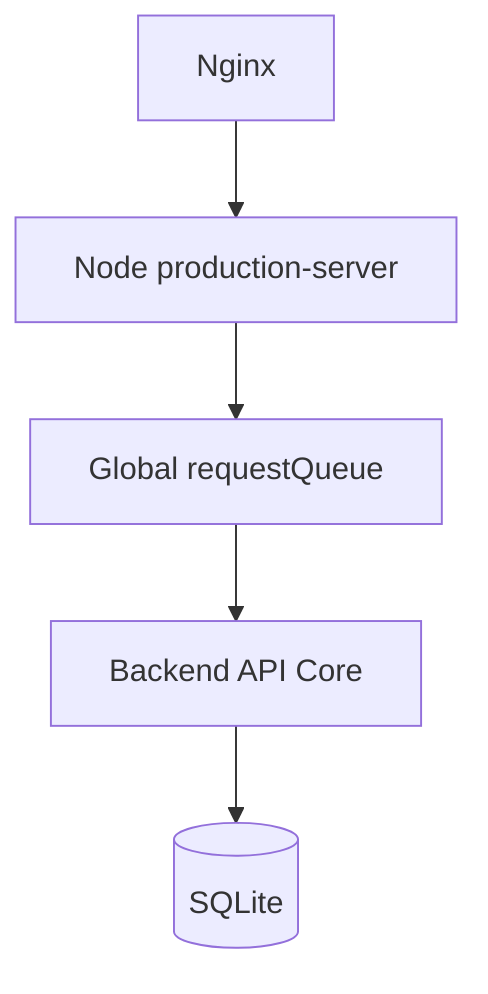
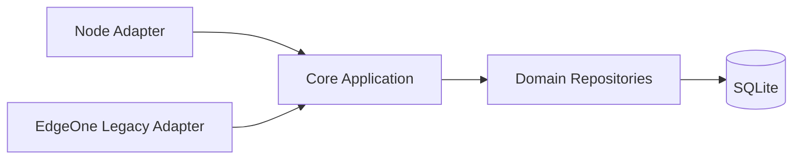

# 系统架构

## 当前生产链路



`requestQueue` 目前仍是数据安全边界的一部分，因为部分旧 Domain Mutation 仍走 Snapshot 写入。

## Backend R2 目标



目标变化包括：

```text
Snapshot
→ Direct SQLite Repository

Global Serialization
→ Normal Concurrency

Edge Function-shaped Core
→ Direct Server Core

API Monolith
→ Domain Modules
```

但迁移顺序受数据一致性约束：只要正常业务仍存在 Snapshot Mutation，就不能提前删除全局队列。
